# ContactAPP
|界面功能     | 图片     |
| ------------- |:-------------:|
| 程序架构        |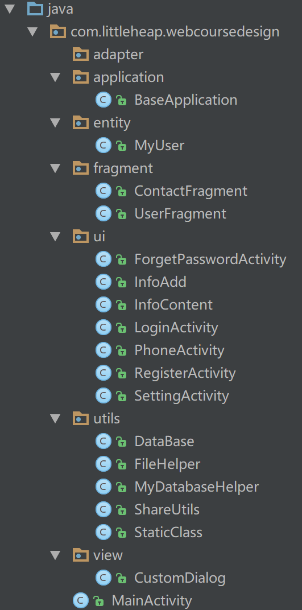|
|注册界面         |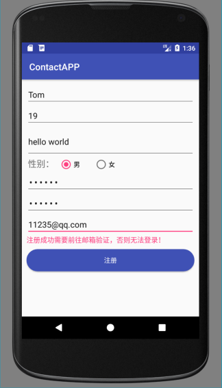|
| 登录界面        |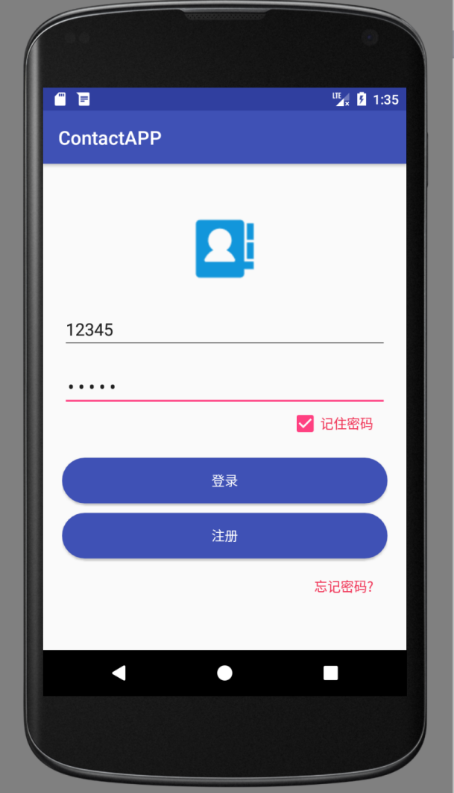|
| 登录成功        |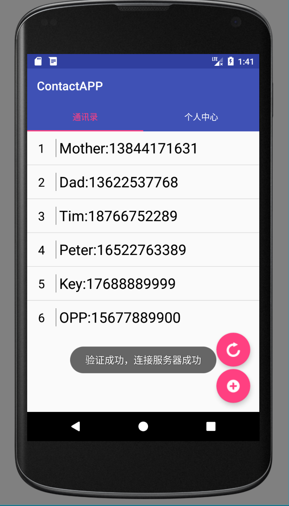|
| 编辑界面        |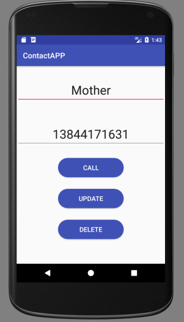|
|添加界面         |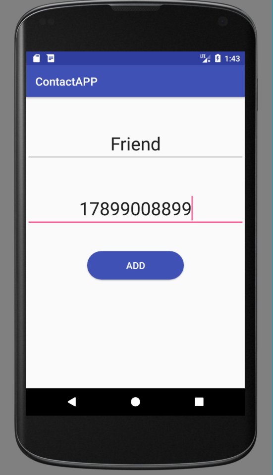|
| 同步成功        |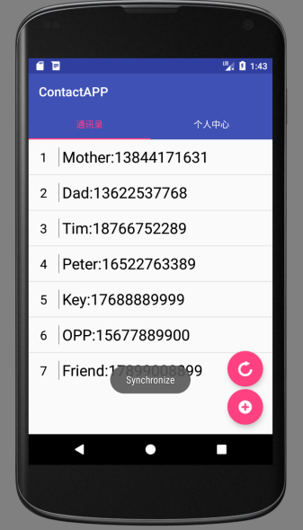|
| 个人中心界面    |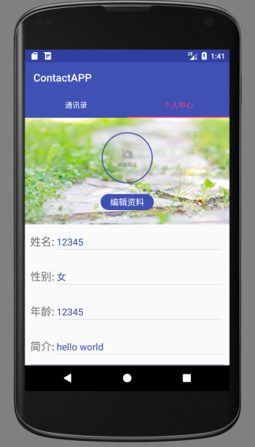|
| 号码归属地查询界面  |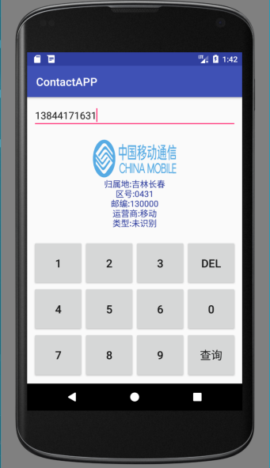|
| Sqlite3本地数据库  |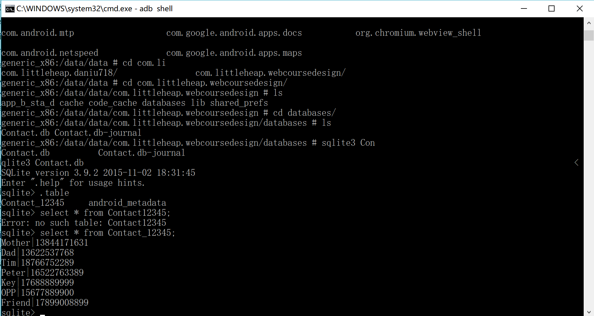|
| 服务器界面         |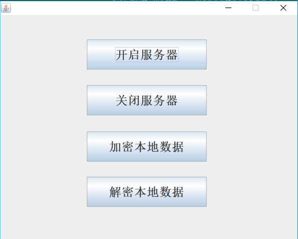|
| Bmob云用户管理界面  |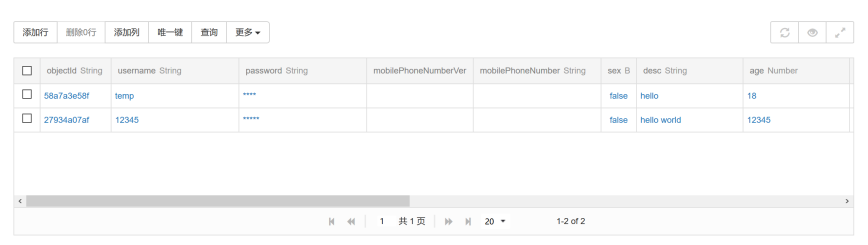|
